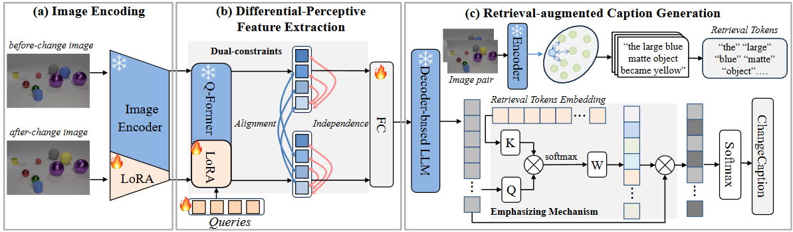

# Differential-Perceptive and Retrieval-Augmented MLLM for Change Captioning(ACM MM 2024)



This repository is the official implementation of "Differential-Perceptive and Retrieval-Augmented MLLM for Change Captioning". ACM MM, 2024.

> **[Differential-Perceptive and Retrieval-Augmented MLLM for Change Captioning](https://openreview.net/pdf?id=eiGs5VCsYM)**<br>
> Xian Zhang^1, [Haokun Wen](https://haokunwen.github.io/)^1,  [Jianlong Wu](https://jlwu1992.github.io)^1, Pengda Qin^2, Hui Xue^2, [Liqiang Nie](https://liqiangnie.github.io/)^1<br>
> ^1Harbin Institute of Technology, Shenzhen, ^2Alibaba Group

## 🔨 Installation

The codebase is mainly built with following libraries:

- Python 3.9
- [PyTorch](https://pytorch.org/) and [torchvision](https://github.com/pytorch/vision). 
- [huggingface](https://huggingface.co/docs/transformers/main/zh/installation)
- [lavis](https://pypi.org/project/salesforce-lavis/)
- [loralib](https://pypi.org/project/loralib/)

The raw pretrianed weight of Vicuna-7B version in InstructBLIP is available at [Hugging Face.](https://huggingface.co/Salesforce/instructblip-vicuna-7b) 

## ➡️ Data Preparation

### Dataset

**For CLEVR-Change**

The official data can be found here: [google drive link](https://drive.google.com/file/d/1HJ3gWjaUJykEckyb2M0MB4HnrJSihjVe/view) provided by [Robust Change Captioning (ICCV19)](https://github.com/Seth-Park/RobustChangeCaptioning).

**For Spot-the-Diff**

Resized images can be download from [Learning to Describe Differences Between Pairs of Similar Images (EMNLP18)](https://github.com/harsh19/spot-the-diff/blob/master/data/get_images.txt). Raw captions can be download from [link](https://github.com/harsh19/spot-the-diff/tree/master/data/annotations). 

**For Image-Editing-Request**

The official data can be found here: [google drive link](https://drive.google.com/drive/folders/1p_hkPwRUiLl1RHV3DkzQk3ti-GzHzT7O) provided by [Expressing Visual Relationships via Language (ACL 2019).](https://github.com/airsplay/VisualRelationships)


### Prepare for Evaluation

**For CLEVR-Change**

To evaluate captions, we need to first reformat the caption annotations into COCO eval tool format. Please run the command `python utils/eval_utils.py` according to the instructions given in `Evaluation` in [Robust Change Captioning (ICCV19)](https://github.com/Seth-Park/RobustChangeCaptioning).

Renaming the output file as `clevr_test_change_captions_reformat.json`.

**For Spot-the-Diff and Image-Editing-Request**

Running the command `python preprocess/eval_utils.py`, renaming the output file as `spot_test_change_captions_reformat.json`.

We provide these evaluation files in the `eval_data/` directory:

```
eval_data
|–– clevr_test_change_captions_reformat.json
|–– spot_val_change_captions_reformat.json
|–– spot_test_change_captions_reformat.json
|–– IER_val_change_captions_reformat.json
|–– IER_test_change_captions_reformat.json
```


### Retrieval corpus for RAG

The retrieval augmented generation (RAG) requires a effective retriever for visual-to-text retrieval. We utilized the pretrained model from [CLIP4IDC](https://github.com/sushizixin/CLIP4IDC/tree/master) to retrieve texts, where the corpus is a collection of texts in the training set of each dataset.

The corpus retrieved in our work can be downloaded from [FINER-MLLM ModelScope](https://www.modelscope.cn/models/izhangxian/FINER-MLLM). You can get the following files:

```
rag_store
|–– clevr_retrieval_corpus_store.json
|–– spot_retrieval_corpus_store.json
|–– IER_retrieval_corpus_store.json
```

**Note**: Since  [CLIP4IDC](https://github.com/sushizixin/CLIP4IDC/tree/master) does not provide the pre-trained weights on Image-Editing-Request, we retrieve the corpus after reproducing it according to the paper's method. The retrieval results we reproduced on Image-Editing-Request are slightly worse than the retrieval metrics provided by the original paper. We also provide the detailed process of retrieval corpus on [FINER-MLLM ModelScope](https://www.modelscope.cn/models/izhangxian/FINER-MLLM).


## 🔄 Running

In our experiments, we utilzed a single gpu for training and evaluation.

Detailed commands for training model with single GPU:

```
# Clevr-change
bash scripts/train_clevr.sh

# Spot-the-diff
bash scripts/train_spot.sh

# Image-editing-request
bash scripts/train_IER.sh
```

The commands for evaluation:

```
bash scripts/eval.sh
```


## 📍 Pretrained Weights
You can download the pretrined weights and other necessary files on [FINER-MLLM ModelScope](https://www.modelscope.cn/models/izhangxian/FINER-MLLM).


## ✏️ Citation
If you find the repo useful for your research, please consider citing our paper:
```bibtex
@inproceedings{
zhang2024finermllm,
title={Differential-Perceptive and Retrieval-Augmented {MLLM} for Change Captioning},
author={Xian Zhang and Haokun Wen and Jianlong Wu and Pengda Qin and Hui Xue' and Liqiang Nie},
booktitle={ACM Multimedia 2024},
year={2024},
url={https://openreview.net/forum?id=eiGs5VCsYM}
}
```
